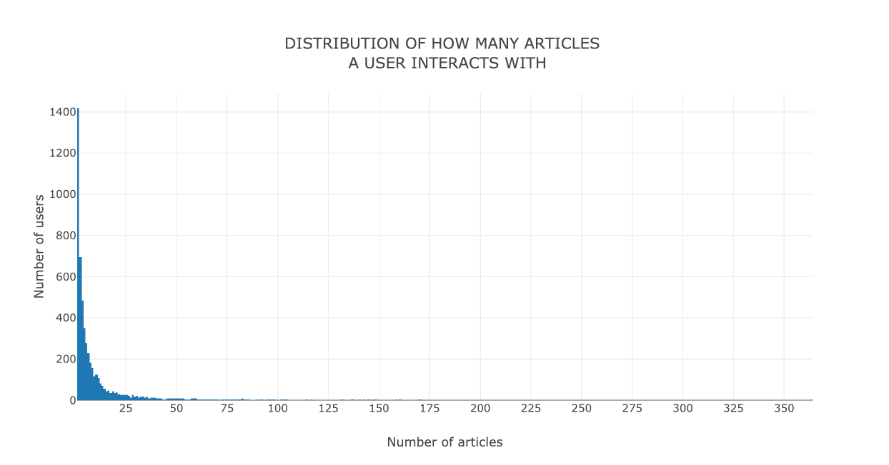

# Data Scientist Nanodegree

## Recommendation Engines

## Project: Recommendations with IBM

## [Blog Version](https://medium.com/@sanjeevai/recommendations-with-ibm-7f89d25375fc)

## Table of Contents

- [Project Introduction](#intro)
- [Exploratory Data Analysis](#eda)
- [Rank Based Recommendations](#rank)
- [User-user Based Collaborative Filtering](#user-user)
- [Matrix Factorisation](#matrix_fac)
- [Conclusion](#conclusion)
- [Files](#files)
- [Software and Libraries](#sw_lib)

***

## Project Introduction

For this project I will analyze the interactions that users have with articles
on the **IBM Watson Studio platform,** and make recommendations to them about
new articles I think they will like. Below is an example of what the
dashboard could look like displaying articles on the IBM Watson Platform.

In order to determine which articles to show to each user, I will be performing a study of the data available on the IBM Watson Studio platform.

## Exploratory Data Analysis

Most of the users have maximum 3 interactions with any article on the platform and this distribution is highly **skewed** because interactions are less.

## Rank Based Recommendations

This type of recommendation system provide the top articles view in this
dataset.

We can set how many recommendations to provide.

## User-user Based Collaborative Filtering

We provide a `user_id` for which we want recommendations. Then we sort each user
based on similarity with the given `user_id`.

For each sorted user, we find the articles this sorted user has interacted with
to add to recommedations list.

Then we select the top m recommendations, m being the number of recommendations
to provide for a specific `user_id`.

## Matrix Factorisation

In this section we first perform SVD on the user_item interactions matrix. We
then see the behaviour of accuracy with the number of latent features. Since the
data is highly imbalanced, we also check the variation of F1 score with the
number of latent features. F1 score increases upto a limit and then drops
asymptotically.

We have a highly imbalanced data set because of less interactions on the platform.

## Conclusion

There were only 20 customer for which we can try and provide recommendation. If
we had more data then performance of our recommendation engine could be
evaluated more efficiently. We have a highly imbalanced data because of many
zeroes in the user-item interaction matrix. I will try **content recommendation** in
future iteractions to tackle the **cold start problem**.

## Files

<pre>
.
├── Recommendations_with_IBM.html----------# HTML EXPORT OF JUPYTER NOTEBOOK
├── Recommendations_with_IBM.ipynb---------# ANALYSIS NOTEBOOK
├── data
│   ├── articles_community.csv-------------# INFORMATION ABOUT ARTICLES
│   └── user-item-interactions.csv---------# USER-ARTICLE INTERACTIONS
├── project_tests.py-----------------------# UNIT TESTS FOR PROJECT
├── top_10.p-------------------------------# BINARY FILE TO CHECK MY SOLUTION
├── top_20.p-------------------------------# BINARY FILE TO CHECK MY SOLUTION
├── top_5.p--------------------------------# BINARY FILE TO CHECK MY SOLUTION
├── user_item_matrix.p---------------------# BINARY FILE TO CHECK MY SOLUTION
└── visuals.py-----------------------------# CUSTOM PLOTS CREATED IN PLOTLY
</pre>

## Software and Libraries

This is project uses Python 3.6.6 and the necessary libraries are mentioned in _requirements.txt_.
